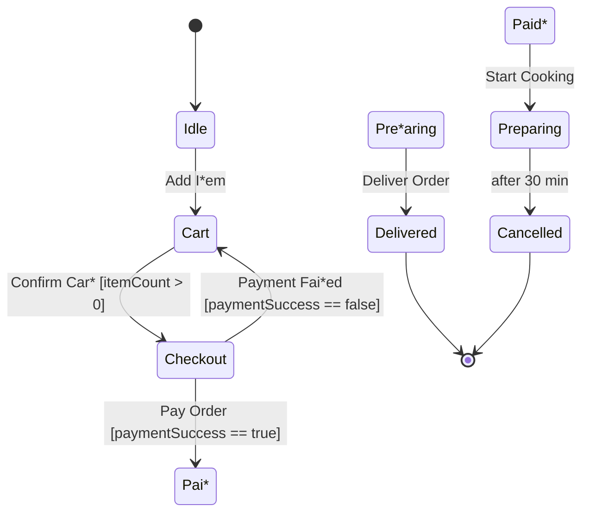

# Homework 02 - Extended FSM

## Online Food Ordering System EFSM

Variables:
- itemCount
- paymentSuccess

Guards:
- [itemCount > 0]
- [paymentSuccess == true]

Timer:
- after 30 min

```mermaid
stateDiagram-v2

[*] --> Idle

Idle --> Cart : Add I*em
Cart --> Checkout : Confirm Car* [itemCount > 0]

Checkout --> Pai* : Pay Order [paymentSuccess == true]
Checkout --> Cart : Payment Fai*ed [paymentSuccess == false]

Paid*--> Preparing : Start Cooking

Pre*aring --> Delivered : Deliver Order

Preparing --> Cancelled : after 30 min

Delivered --> [*]
Cancelled --> [*]
```
